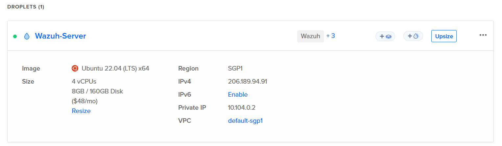
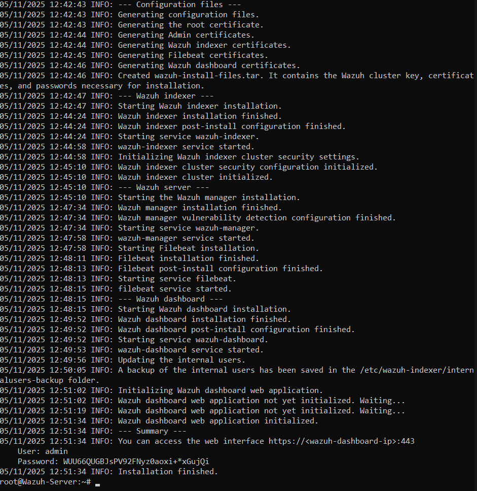
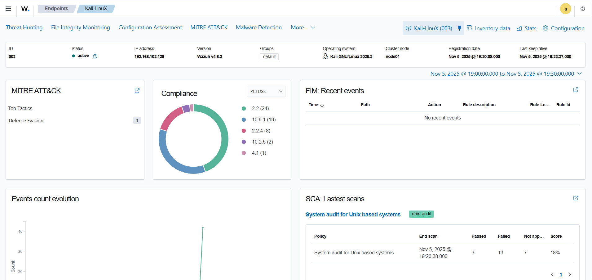
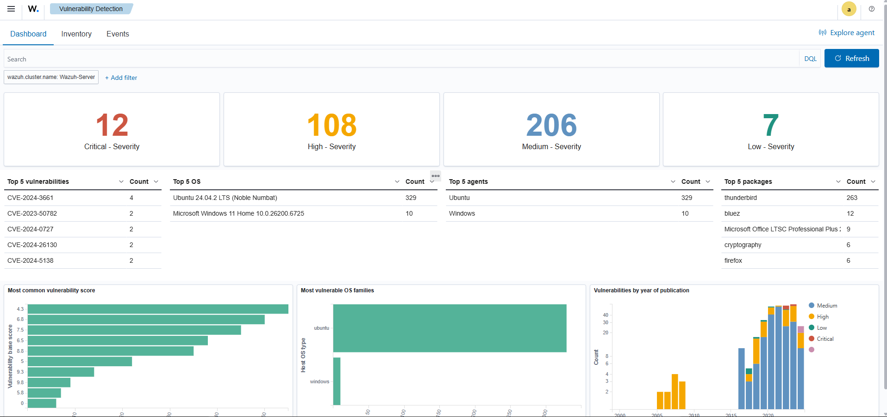
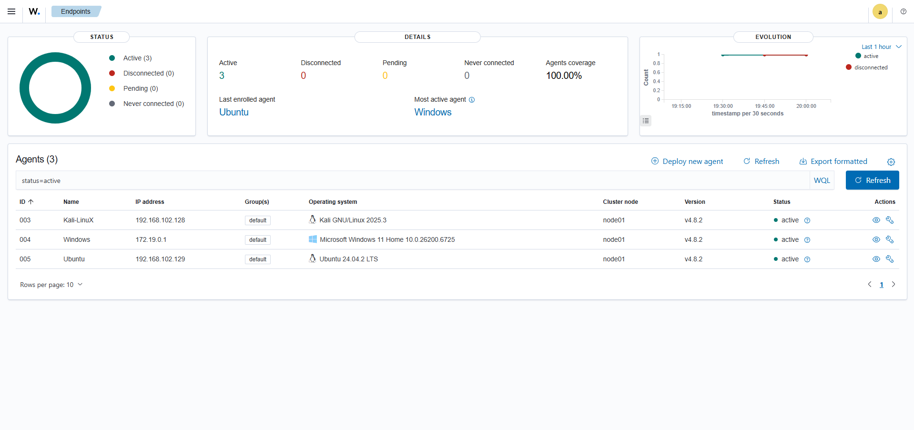

# 🌩️ Cloud-Based SIEM Project using Wazuh

## 🧠 Introduction

In modern cybersecurity operations, **Security Information and Event Management (SIEM)** solutions play a crucial role in collecting, correlating, and analyzing security events across an organization’s systems. This project focuses on building a **Cloud-based SIEM** using **Wazuh**, a powerful open-source platform that combines log analysis, intrusion detection, vulnerability detection, and incident response capabilities.

The goal of this project was to design a **centralized monitoring environment** capable of analyzing security events from multiple endpoints — Windows, Ubuntu, and Kali Linux — all reporting to a **cloud-hosted Wazuh server** deployed on **DigitalOcean**. By leveraging Wazuh’s real-time analysis and correlation capabilities, this setup simulates a real-world Security Operations Center (SOC) environment.

---

## ☁️ Cloud SIEM Overview

Wazuh is a unified platform for **threat detection, compliance monitoring, and security analytics**. It provides deep visibility into endpoint and network behavior through:

* **Log data collection** from diverse systems
* **File integrity monitoring (FIM)** to detect unauthorized changes
* **Vulnerability assessment** for endpoints
* **Real-time alerts and dashboards** mapped to the MITRE ATT&CK framework

By hosting the Wazuh Manager on the **DigitalOcean cloud**, the system gains scalability, accessibility, and a production-like architecture — similar to enterprise-grade SIEM deployments.

---

## 🏗️ Project Architecture

The architecture for this project consists of one **Wazuh server** hosted on the cloud and three connected **agents** representing different operating systems.

```
Windows (Agent)  ── \
                     \
Ubuntu (Agent)    ── ── ----------->  DigitalOcean Droplet (Wazuh Manager + Indexer + Dashboard)
                     /
KaliLinuX(Agent) ── /
```

This design provides a realistic environment for observing security telemetry from multiple systems and understanding how a SIEM aggregates and visualizes data from heterogeneous sources.

---

## 🔍 Key Components

* **Wazuh Manager:** Processes events, applies detection rules, and generates alerts.
* **Wazuh Indexer:** Stores indexed logs and event data for fast searches.
* **Wazuh Dashboard:** Provides a graphical interface for viewing alerts, vulnerabilities, and system health.
* **Wazuh Agents:** Installed on endpoints (Windows, Linux, Kali) to collect logs and security telemetry.

---

## 🧰 Project Implementation Phases

1. Deployed a **DigitalOcean Droplet** (Ubuntu 22.04 LTS) to host Wazuh.
2. Configured secure access with **UFW firewall** and SSH key authentication.
3. Installed Wazuh (Manager, Indexer, and Dashboard) using the official setup script.
4. Added and authenticated **Windows, Ubuntu, and Kali agents** to the Wazuh Manager.
5. Conducted vulnerability scans and observed real-time alerts on the Wazuh Dashboard.

---

## 📊 Dashboard and Analysis

Screenshots from the project illustrate the deployment process and monitoring insights.

### 🖥️ 1. DigitalOcean Droplet Specifications

This shows the DigitalOcean cloud droplet used to host the Wazuh Manager.  
Ubuntu 22.04 LTS was selected with 8 GB RAM and 4 vCPUs for optimal SIEM performance.  
It serves as the centralized point for collecting and analyzing logs from all agents.

---

### 🔐 2. SSH Connection to Wazuh Server

Secure SSH connection established from the Windows host terminal to the cloud server.  
This enables remote configuration and management of the Wazuh instance.  
Proper SSH authentication ensures encrypted communication with the droplet.

---

### ⚙️ 3. Wazuh Installation on Server

Wazuh installation completed successfully on the Ubuntu droplet.  
The script deployed the Manager, Indexer, and Dashboard components.  
This step forms the backbone of the SIEM architecture for event collection and analysis.

---

### 🧭 4. Wazuh Dashboard Login

The web-based Wazuh Dashboard confirms a successful deployment.  
Accessed securely via HTTPS on port 443, it provides visualization of all security data.  
This is where real-time alerts, vulnerabilities, and agent statuses are monitored.

---

### 🪟 5. Windows Agent Overview

The Windows agent was added and authenticated to the Wazuh Manager.  
It collects Windows event logs, vulnerability data, and Sysmon telemetry.  
This provides deep insight into endpoint security and system activity.

---

### 🐉 6. Kali Linux Agent Overview

The Kali Linux agent demonstrates monitoring of a penetration testing environment.  
It helps simulate attack scenarios and validate detection capabilities in Wazuh.  
This showcases how the SIEM detects reconnaissance and scanning behaviors.

---

### 🐧 7. Ubuntu Agent Overview

The Ubuntu agent connects successfully to the Wazuh Manager.  
It monitors system logs, file integrity, and software vulnerabilities.  
This confirms cross-platform visibility and log correlation in the SIEM.

---

### 🧩 8. Vulnerability Detection (All Endpoints)

Wazuh’s built-in vulnerability detection module identifies known CVEs.  
It analyzes package and OS-level vulnerabilities across all agents.  
This centralized view supports proactive system hardening and patching.

---

### 🪟 9. Vulnerability Detection (Windows Only)

This filtered dashboard focuses on Windows endpoint vulnerabilities.  
It highlights the critical, high, and medium-severity issues specific to Windows hosts.  
Helps prioritize remediation based on endpoint risk and exposure.

---

### 🌐 10. Endpoint Device Summary in Wazuh

Displays the list of all connected agents — Windows, Ubuntu, and Kali Linux.  
Shows each agent’s version, connection status, and last communication time.  
Confirms that the Wazuh Manager is actively monitoring all endpoints.

---

## 🎯 Project Outcome

By completing this project, A comprehensive understanding of how a cloud-based SIEM functions in a hybrid environment can be Gained. The system successfully collected and correlated data from multiple platforms, providing visibility into endpoint activity, system vulnerabilities, and potential security threats.

---

## 🧠 Skills Gained

| Category                    | Skills Developed                                                 |
| --------------------------- | ---------------------------------------------------------------- |
| **Cloud Security**          | Deployment and management of security systems on cloud platforms |
| **SIEM Operations**         | Agent integration, alert correlation, and log analysis           |
| **System Administration**   | Firewall (UFW) configuration and secure remote access setup      |
| **Incident Response**       | Vulnerability detection and response evaluation                  |
| **Technical Documentation** | Comprehensive write-up and evidence-based reporting              |

---

## 🏁 Conclusion

This project showcases the power of **open-source SIEM tools** in building scalable, cloud-ready cybersecurity solutions. Hosting Wazuh on DigitalOcean provided a real-world simulation of enterprise SOC environments, where multiple endpoint systems generate and forward logs for centralized monitoring and analysis.

---

🧑‍💻 Built By Umar Ahamed Cybersecurity Student • Sri Lanka

Passionate about security automation, ethical hacking, and student empowerment

⭐ Connect via GitHub: https://github.com/User-Umar-Ahamed
