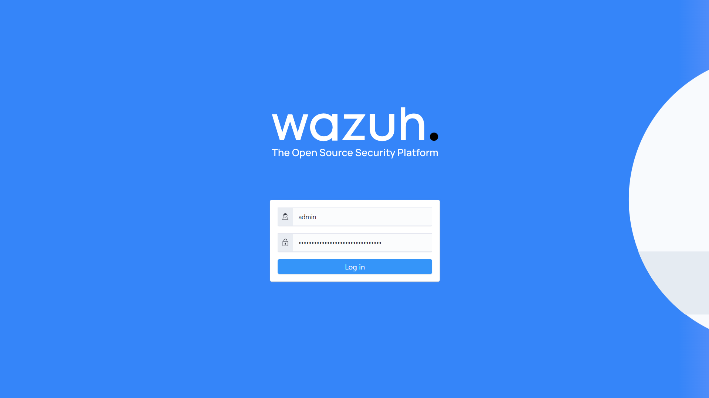

# 🌩️ Cloud-Based SIEM Project using Wazuh

## 🧠 Introduction

In modern cybersecurity operations, **Security Information and Event Management (SIEM)** solutions play a crucial role in collecting, correlating, and analyzing security events across an organization’s systems. This project focuses on building a **Cloud-based SIEM** using **Wazuh**, a powerful open-source platform that combines log analysis, intrusion detection, vulnerability detection, and incident response capabilities.

The goal of this project was to design a **centralized monitoring environment** capable of analyzing security events from multiple endpoints — Windows, Ubuntu, and Kali Linux — all reporting to a **cloud-hosted Wazuh server** deployed on **DigitalOcean**. By leveraging Wazuh’s real-time analysis and correlation capabilities, this setup simulates a real-world Security Operations Center (SOC) environment.

---

## ☁️ Cloud SIEM Overview

Wazuh is a unified platform for **threat detection, compliance monitoring, and security analytics**. It provides deep visibility into endpoint and network behavior through:

* **Log data collection** from diverse systems
* **File integrity monitoring (FIM)** to detect unauthorized changes
* **Vulnerability assessment** for endpoints
* **Real-time alerts and dashboards** mapped to the MITRE ATT&CK framework

By hosting the Wazuh Manager on the **DigitalOcean cloud**, the system gains scalability, accessibility, and a production-like architecture — similar to enterprise-grade SIEM deployments.

---

## 🏗️ Project Architecture

The architecture for this project consists of one **Wazuh server** hosted on the cloud and three connected **agents** representing different operating systems.

```
Windows (Agent)  ── \
                     \
Ubuntu (Agent)    ──   ----------->  DigitalOcean Droplet (Wazuh Manager + Indexer + Dashboard)
                     /
KaliLinuX(Agent) ── /
```

This design provides a realistic environment for observing security telemetry from multiple systems and understanding how a SIEM aggregates and visualizes data from heterogeneous sources.

---

## 🔍 Key Components

* **Wazuh Manager:** Processes events, applies detection rules, and generates alerts.
* **Wazuh Indexer:** Stores indexed logs and event data for fast searches.
* **Wazuh Dashboard:** Provides a graphical interface for viewing alerts, vulnerabilities, and system health.
* **Wazuh Agents:** Installed on endpoints (Windows, Linux, Kali) to collect logs and security telemetry.

---

## 🧰 Project Implementation Phases

1. Deployed a **DigitalOcean Droplet** (Ubuntu 22.04 LTS) to host Wazuh.
2. Configured secure access with **UFW firewall** and SSH key authentication.
3. Installed Wazuh (Manager, Indexer, and Dashboard) using the official setup script.
4. Added and authenticated **Windows, Ubuntu, and Kali agents** to the Wazuh Manager.
5. Conducted vulnerability scans and observed real-time alerts on the Wazuh Dashboard.

---

## 📊 Dashboard and Analysis

Screenshots from the project illustrate the deployment process and monitoring insights.

### Cloud Droplet Specifications


*DigitalOcean droplet configured for Wazuh server deployment.*

### Wazuh Dashboard Login


*Successful access to the cloud-hosted Wazuh Dashboard.*

### Endpoint Agents


*Connected endpoint agents — Windows, Ubuntu, and Kali — displayed in the Wazuh Dashboard.*

### Vulnerability Detection Overview


*Centralized vulnerability analysis across all endpoint systems.*

---

## 🎯 Project Outcome

By completing this project, I achieved a comprehensive understanding of how a cloud-based SIEM functions in a hybrid environment. The system successfully collected and correlated data from multiple platforms, providing visibility into endpoint activity, system vulnerabilities, and potential security threats.

---

## 🧠 Skills Gained

| Category                    | Skills Developed                                                 |
| --------------------------- | ---------------------------------------------------------------- |
| **Cloud Security**          | Deployment and management of security systems on cloud platforms |
| **SIEM Operations**         | Agent integration, alert correlation, and log analysis           |
| **System Administration**   | Firewall (UFW) configuration and secure remote access setup      |
| **Incident Response**       | Vulnerability detection and response evaluation                  |
| **Technical Documentation** | Comprehensive write-up and evidence-based reporting              |

---

## 🏁 Conclusion

This project showcases the power of **open-source SIEM tools** in building scalable, cloud-ready cybersecurity solutions. Hosting Wazuh on DigitalOcean provided a real-world simulation of enterprise SOC environments, where multiple endpoint systems generate and forward logs for centralized monitoring and analysis.

---

🧑‍💻 Built By Umar Ahamed Cybersecurity Student • Sri Lanka

Passionate about security automation, ethical hacking, and student empowerment

⭐ Connect via GitHub: https://github.com/User-Umar-Ahamed
